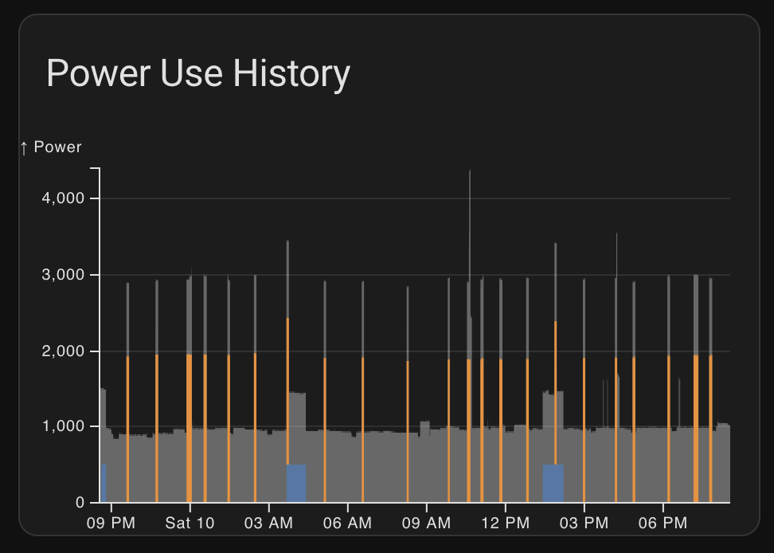

# Power use area chart

This is a chart which displays:
* Power use of individual devices in your home as a stacked area chart
  * By this is pulled from dynamically filtered entities with label "Power Measured Devices" and unit "W"
* An "envelope" in the background from your main power meter
  * This is pulled from `sensor.power_meter_han_power` entity

The goal of this chart is to be able to easily visually correlate changes in power demand over time in your home with individual devices switching on and off.
